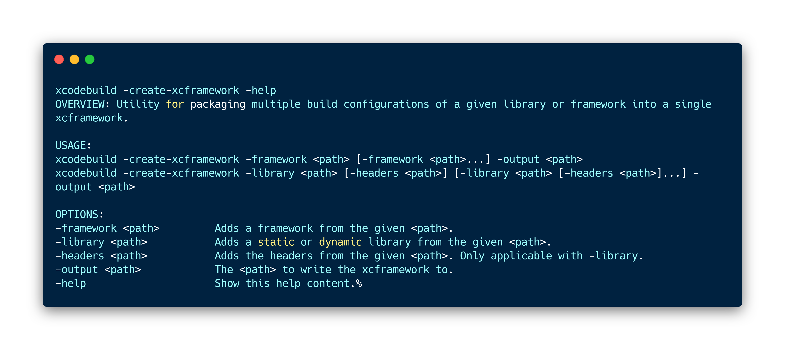
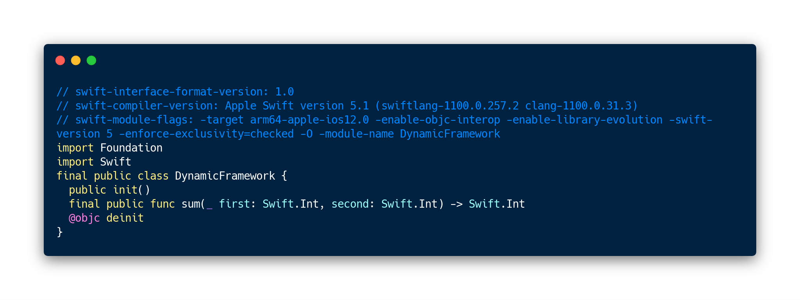
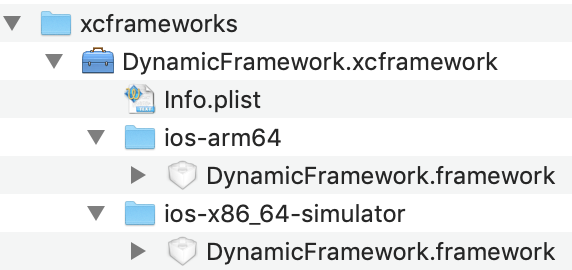
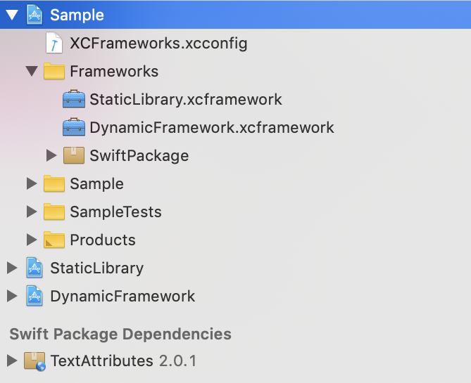

# xcframeworks
This is a demonstration of creating and integrating the xcframeworks and their co-op with static libraries and Swift packages within the same Xcode project.


## Pre-requisities
- Xcode 11
- Swift 5.1 toolchain - run `sudo xcode-select -s path/to/Xcode11` in terminal.
- Github/Gitlab/Bitbucket account set in Xcode's account preferences

# .xcframework - How To

## Requirements
- Xcode11
- Swift 5.1 and above

## Motivation & consequences
- gain module stability for your Swift frameworks & libraries.
- support all Apple platforms and architectures - this is where `lipo` command line tool falls short - e.g. arm6 architecture can be found in iOS + watchOS, thus using `lipo` wouldnt be sufficient.

- **STOP** creating & using `fat frameworks` == no more `lipo`.
- **STOP** slicing frameworks by stripping the architectures in your projects' targets' custom `build-phase`.

## Platforms
xcframework supports all Apple platforms - `iOS`, `macOS`, `tvOS`, `watchOS`, `iPadOS` platforms.

## List of destinations
| Platform  |  Destination |
|---|---|
| iOS  | generic/platform=iOS  |
| iOS Simulator  | generic/platform=iOS Simulator |
| iPadOS  | generic/platform=iPadOS |
| iPadOS Simulator  | generic/platform=iPadOS Simulator|
| macOS  | generic/platform=macOS  |
| tvOS  | generic/platform=tvOS  |
| watchOS | generic/platform=watchOS |
| watchOS Simulator | generic/platform=watchOS Simulator |

---

## How to create .xcframework that contain iOS + iOS Simulator platforms

### 1. Archive your scheme for desired platforms (destinations)
1.1 Pass `SKIP_INSTALL=NO` && `BUILD_LIBRARY_FOR_DISTRIBUTION=YES` to archive your scheme

```swift
xcodebuild archive \
-workspace MyWorkspace.xcworkspace \
-scheme MyScheme \
-destination destination="generic/platform=iOS" \
-archivePath "archives/MyScheme-iOS" \
SKIP_INSTALL=NO \
BUILD_LIBRARY_FOR_DISTRIBUTION=YES
```

1.2 **iOS Simulator** - archive your scheme for iOS Simulator platform by specifying correct destination `destination="generic/platform=iOS Simulator"` & point archivePath to architecture specific path, e.g. `archives/MyScheme-iOS-Simulator`.

```swift
xcodebuild archive \
..
-destination destination="generic/platform=iOS Simulator" \
-archivePath "archives/MyScheme-iOS-Simulator" \
..
```

1.3 **iOS** - archive your scheme for iOS by specifying `destination="generic/platform=iOS"` & point archivePath to device specific path. The architecture specific path will ensure the archive from step 2. wont be overwritten, e.g. `MyScheme-iOS`

```
xcodebuild archive \
..
-destination destination="generic/platform=iOS" \
-archivePath "archives/MyScheme-iOS" \
..
```

#### Locations
Binaries in `.xcarchive` are located under:

* `Products/Library/Frameworks` folder for dynamic frameworks
* `Products/usr/local/lib` folder for static libraries

### 2. Create .xcframework from built archives

`xcodebuild` allows you to create xcframework by specifying frameworks, libraries or even can add headers to the libraries.



###### 1. Specify all frameworks or libraries that you want to add into .xcframework

###### 2. Specify the outpath paht using `-output` argument. Don't forget to add `.xcframework` extension to your output path.

```
xcodebuild -create-xcframework \
           -framework My-iOS.framework \
           -framework My-iOS_Simulator.framework \
           -output My.xcframework
```

Module stability is gained with Xcode 11 + Swift 5.1, once your module declares `.swiftinterface` file, that describes the public interface of your framework along with linker flags, used toolchain and other info. Swift interface can be found under your framework's `swiftmodule` folder.
`.swiftinterface` file is autogenerated when xcframework is created.



---
## Testing & Troubleshooting

Make sure to always build & run your generated xcframework before distributing it to your clients.
Few of the **problems will unveil just at the compile or run time**, so **don't** rely solely on the success of the xcframework creation.

Here's the list of compiler errors I got across when integrating built xcframework into Xcode project.

| Problem  | Severity |  Description | Solution |
|---|---|---|---|
| Redundant conformance of `x` to `NSObjectProtocol` | error - thrown at integration point | Your class is already subclassed from `NSObject`, which conforms to `NSObjectProtocol`  | Check protocol conformances of your classes and remove redundant conformance to `NSObjectProtocol` |
| scoped imports are not yet supported in module interfaces | warning | Read more about Swift import declarations here: https://nshipster.com/import/ | Import the module instead of specific declaration. For example: change `import class MyModule.MyClass` to `import MyModule` |


## Generate .xcframeworks for iOS + iOS Simulator using create_xcframeworks.sh script
The archiving and creation of `.xcframework` is excercised by [create_xcframeworks.sh](/scripts/create_xcframeworks.sh) script.

This script takes 1 parameter that defines output directory.
`Output directory` will create subfolder for `archives` and `xcframeworks`.

The script will:
- archive the scheme `StaticLibrary` & create the .xcframework
- archive the scheme `DynamicFramework` & create the .xcframework



`Usage`

```
./scripts/create_xcframeworks.sh OUTPUT_DIRECTORY_NAME
```

eg.
```
./scripts/create_xcframeworks.sh Products
```

---

# How to integrate .xcframework in your project

1. Drag & drop .xcframework manually into your project's target


2. Embed & sign .xcframework in your project's target


---

# Distribution of xcframeworks
* manually - available as of today

* **Carthage** - [work in progress PR #2820](https://github.com/Carthage/Carthage/pull/2820)
* **CocoaPods** - there's open [feature request for v1.9.0](https://github.com/CocoaPods/CocoaPods/issues/9148)

---

# Description of XCFrameworks workspace

`XCFrameworks` workspace consists of:
- `StaticLibrary` project - represents static library project
- `DynamicFramework` project - represents project that builds dylib
- `Swift Package` - Swift Package for internal development (within Sample project)
- `TextAttributes` - external Swift Package

- `Sample` - Sample project that includes all of the dependencies mentioned above.



---

---

# Materials

## Presentation about Dependency management in Xcode 11
https://www.slideshare.net/BorisBielik/dependency-management-in-xcode-11-153424888

## Binary Frameworks in Swift
https://developer.apple.com/videos/play/wwdc2019/416/

## ABI Stability & Module Stability - swift.org
https://swift.org/blog/abi-stability-and-more/
